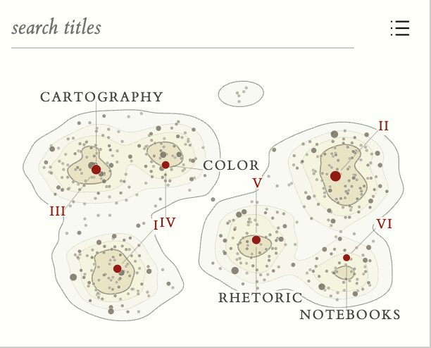

# Tufte Map

   

Your vault's link graph, drawn as a contour map. Notes that link to one another lie close together, the land rises where notes are dense, and each summit is named after its most connected note. It is a companion to the [**Tufte for Obsidian**](https://github.com/PleiadesM/TufteObsidian) theme, in its paper, ink and single red, and it reads the colours of any other theme too.



## What it shows

- **Terrain from links.** The layout comes from the link graph alone, so notes do not need any text for the map to work. Contour lines mark the density; every fourth line is an index contour.
- **Summits.** Each hill is anchored on its most connected note, drawn in red and named in small capitals. Red numerals rank the hills by height.
- **Dots.** One dot per note. Its area is proportional to its number of links. Ordinary notes are warm greys, deeper and more opaque the more central they are.
- **Bridges.** Links that run from one summit's region to another's are drawn as faint hairlines. They are stronger over the water between the mountains and fainter over the land.
- **Islets.** Groups of notes that link only to each other sit near the centre, with open water around them.

## Using it

- Open the map from the ribbon (map icon) or the command **Open knowledge map**. It opens in a tab or in the sidebar (Settings → Tufte Map → *Open the map in*). In a narrow sidebar it switches to a compact presentation.
- **Hover** a dot to see its name and its links. **Click** to open the note in a companion tab; ⌘/Ctrl-click opens a new one; ⌘/Ctrl-hover shows Obsidian's page preview. On touch, tap once to see a name and tap again to open the note.
- **Zoom** with a pinch or ⌘/Ctrl-scroll; zooming in names more notes. Double-click to zoom in; press 0 to reset.
- The corner toggle opens the **details**: find a note, list the summits and folders (hover to isolate, click to pin), switch bridges or all links on and off.
- The layout is remembered and warm-started when the vault changes, so the map stays recognisable as it grows. **Redraw knowledge map from scratch** forgets it.

Settings: excluded folders, where the map opens, how many notes to name, a text fade threshold (like the graph view's), links between summits, all links.

## Install

Until Tufte Map is listed in the community directory, install it by hand: download `main.js`, `manifest.json` and `styles.css` from the [latest release](../../releases/latest), put all three in `YourVault/.obsidian/plugins/tufte-map/`, then Settings → Community plugins → enable **Tufte Map**.

## Requirements

- Obsidian 1.4.0 or newer.
- Desktop and mobile. No network access, no telemetry, nothing to build. The map is computed on your device from Obsidian's own link index.

## How this plugin is built

One hand-written `main.js` in plain CommonJS, with no bundler and no dependencies. It computes everything itself, in small cooperative steps that keep the app responsive:

1. A random-walk profile of each note's links, and k-nearest affinities.
2. A UMAP-style layout (spectral start, then stochastic gradient descent).
3. Terrain by binning and Gaussian blur, with marching-squares contours.
4. Summits anchored on the best-connected note of each hill.
5. Label placement that never prints over a dot.

`data.json` holds only the settings and each note's two map coordinates.

`dev/` holds the tests and runs in place:

```bash
node dev/tests/run.js
```

The browser test page mounts the real plugin against a stubbed app. Serve the repository root (`python3 -m http.server 8766`) and open `/dev/preview/app.html?selftest=1`. One file is not distributed: `dev/preview/obsidian-like.css`, an excerpt of Obsidian's own `app.css` used to reproduce its form-field cascade. Without it the test page still runs; only that cascade check becomes a formality.

## Credits

The idea of drawing a vault as contour terrain with named summits comes from [obsidian-knowledge-map](https://github.com/fengyukongzhou/obsidian-knowledge-map) by fengyukongzhou, a Gemini CLI skill that uses text embeddings. Tufte Map is an independent implementation in JavaScript that works from the link graph, and it contains none of that project's code. The preview's type is [ET Book](https://github.com/edwardtufte/et-book).

## License

MIT — see [LICENSE](LICENSE).

## Changelog

- **0.1.0** (2026-09-23)
  - First release
